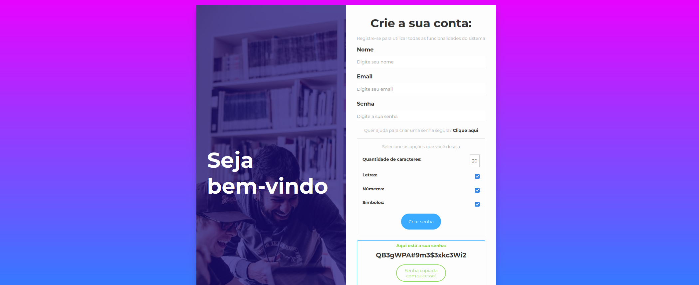
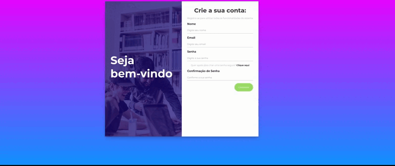

# Gerador de Senha

## Estrutura do Projeto

O projeto consiste em três arquivos principais:

- `index.html`: Contém a estrutura HTML da aplicação.
- `css/style.css`: Folha de estilos para estilizar a aparência da aplicação.
- `js/script.js`: Script JavaScript para funcionalidades dinâmicas da aplicação.

## Como Usar

1. Abra o arquivo `index.html` em um navegador da web.
2. Se desejar uma senha personalizada, clique em "Clique aqui" para abrir as opções de geração.
3. Selecione as opções desejadas, como comprimento, letras, números e símbolos.
4. Clique no botão "Criar senha" para gerar a senha.
5. A senha gerada será exibida, e você pode clicar em "Copiar" para copiá-la para a área de transferência.

## Estilo e Layout

O projeto possui um layout responsivo, com um banner atraente e uma área de formulário limpa e intuitiva. O estilo é moderno, utilizando fontes da família Montserrat.

## Personalização de Senha

O gerador permite personalizar a senha com opções como comprimento, inclusão de letras, números e símbolos. Isso garante que as senhas geradas sejam seguras e atendam aos requisitos específicos do usuário.

## Foto do projeto final

## GIF do projeto

